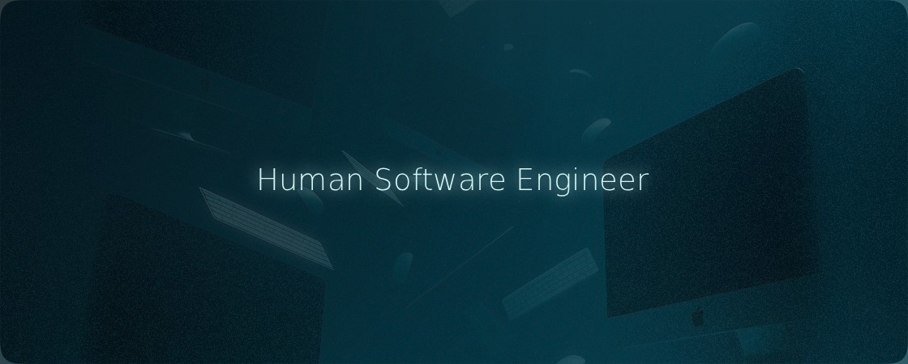

  

## 👨‍💻 Full-Stack AI Engineer | RAG, LangChain, React & Python

I build **production-ready AI systems** that solve real business problems.

I specialize in RAG pipelines, AI agents, and intelligent automation—integrated into clean, scalable web applications. My work combines deep AI expertise with strong full-stack engineering to deliver systems that actually work in production.

# 🛠 Tech Stack

**Languages**  

**Frontend**  

**Backend**  

**AI & ML**  

**Vector Databases**  

**Voice AI**  

# 🙋‍♂️ About Me

I'm a **Full-Stack AI Engineer** with extensive experience building production-ready AI systems. I combine deep AI expertise with strong full-stack engineering skills to deliver solutions that solve real business problems.

> 🔭 Currently building production-ready AI systems and RAG pipelines  
> 🌱 Specializing in AI agents, voice AI, and intelligent automation  
> 💼 Delivering complete solutions with security, scalability, and maintainability built in  
> 🚀 Fast turnaround without compromising quality

## 🎯 What I Build

<table>
<tr>
<td width="50%" valign="top">

### 🤖 AI & Automation
- **RAG Systems** – Custom knowledge bases with semantic search and context-aware responses
- **AI Agents** – Autonomous systems that handle complex workflows and decision-making
- **Voice AI** – Conversational interfaces using Vapi and Retell for customer support and sales

</td>
<td width="50%" valign="top">

### 💻 Full-Stack Development
- **Web Applications** – Modern apps with React, Next.js, and FastAPI backends
- **API Development** – Secure, scalable REST APIs integrated with LLM providers
- **Production Systems** – Deployable solutions with Docker, CI/CD, and monitoring

</td>
</tr>
</table>

## ✨ Why Work With Me

| 🎯 **Complete Solutions** | 💬 **Clear Communication** | 🚀 **Production-Ready** | ⚡ **Fast Delivery** |
|:---|:---|:---|:---|
| End-to-end implementations, not just code snippets | Technical decisions explained in plain English | Security, scalability, and maintainability built-in | Quick turnaround without quality compromise |

## 🌎 Let's Connect!

## 📈 GitHub Stats

---

## 🖇 Featured Projects

<table>
  <thead>
    <tr>
      <th>#</th>
      <th>Project</th>
      <th>Description</th>
      <th>Tech Stack</th>
    </tr>
  </thead>
  <tbody>
    <tr>
      <td>1</td>
      <td><a href="https://github.com/Labrahmi/webserv"><b>webserv</b></a></td>
      <td>High-performance HTTP server built with C/C++. Implements server socket fundamentals, non-blocking I/O, file descriptor monitoring, and CGI handling.</td>
      <td><code>C/C++</code> <code>Socket Programming</code></td>
    </tr>
    <tr>
      <td>2</td>
      <td><a href="https://github.com/Labrahmi/1337-logtime"><b>1337-logtime</b></a></td>
      <td>Next.js application displaying logtime statistics for 1337 students. Built by the web development club with modern UI/UX.</td>
      <td><code>Next.js</code> <code>React</code> <code>TypeScript</code></td>
    </tr>
    <tr>
      <td>3</td>
      <td><a href="https://github.com/Labrahmi/cpp-module-09"><b>cpp-modules</b></a></td>
      <td>Comprehensive C++98 exercises covering Templates, Exceptions, STL containers, and advanced casting techniques.</td>
      <td><code>C++</code> <code>STL</code> <code>OOP</code></td>
    </tr>
    <tr>
      <td>4</td>
      <td><a href="https://github.com/Labrahmi/node-docker"><b>node-docker</b></a></td>
      <td>Docker environment setup for Node.js applications. Includes containerization best practices and deployment configurations.</td>
      <td><code>Node.js</code> <code>Docker</code> <code>DevOps</code></td>
    </tr>
    <tr>
      <td>5</td>
      <td><a href="https://github.com/Labrahmi/cub3d"><b>cub3d</b></a></td>
      <td>3D graphics project using raycasting algorithms. Implements 90s-style 3D rendering with MLX graphics library and pixel manipulation.</td>
      <td><code>C</code> <code>Graphics</code> <code>Raycasting</code></td>
    </tr>
  </tbody>
</table>

> 💡 **Explore more projects** → [View all repositories](https://github.com/Labrahmi?tab=repositories)
